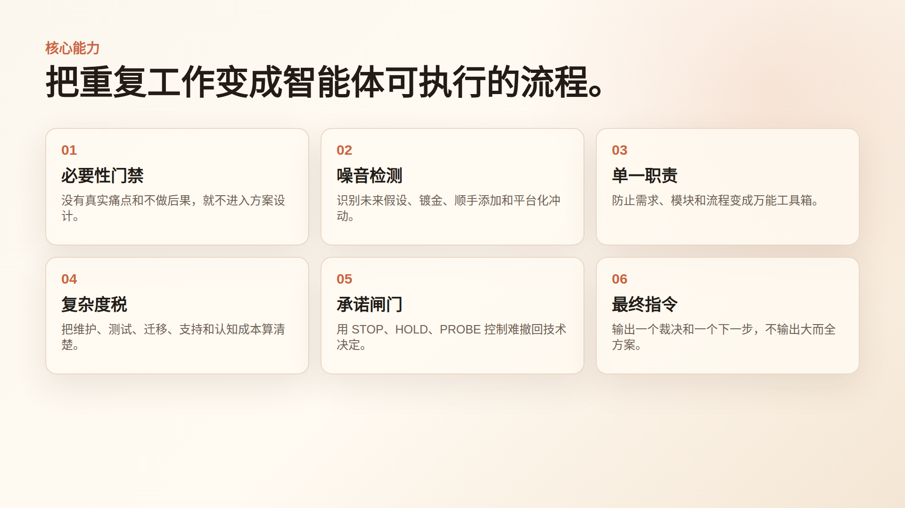

<div align="center">

# GeekX 技能集

**极客杰尼智能体技能合集，把高频工作流沉淀成可复用能力。**


</div>

---

## 这是什么

GeekX 技能集是 [geekjourneyx](https://github.com/geekjourneyx) / 极客杰尼的智能体技能仓库，用来保存真实日常工作中反复使用的工作流。



```text
输入：反复手工执行的工作流
输出：可被支持技能机制的智能体调用的技能
```

---

## 可用技能

| 技能 | 什么时候用 |
|:---|:---|
| `geekx-gate` | 审判需求、方案、架构、路线图或智能体输出是否过度设计；也判断重写、框架、插件系统、工作流引擎等难撤回技术决定现在该不该做。 |

---

## 怎么使用

一句话规则：当你怀疑一个想法太大、太早、太完整、太像未来幻想时，用 `geekx-gate`。

适合这些问题：

- 这个需求现在真的要做吗？
- 这个方案是不是过度设计？
- 这里面哪些是噪音？
- 最小必要升级是什么？
- 这个智能体输出是不是加了太多角色、流程、配置或抽象？
- 现在要不要重写、换框架、做插件系统或引入工作流引擎？
- 这个技术决定以后会不会很难撤回？
- 要不要开庭，用多线程证据收集做一次受限审判？

它会强制输出：

- 裁决：保留、砍掉、延期、先验证、缩小范围
- 承诺闸门：跳过、STOP、HOLD、PROBE
- 真实需求
- 噪音
- 非目标
- 复杂度税
- 最终只给一个下一步

---

## 安装

安装全部技能：

```bash
npx skills add geekjourneyx/geekx-skills --all
```

查看可用技能：

```bash
npx skills add geekjourneyx/geekx-skills --list
```

安装单个技能：

```bash
npx skills add geekjourneyx/geekx-skills --skill geekx-gate
```

---

## 使用示例

```text
使用 geekx-gate 审查这个方案是否过度设计。
```

```text
使用 geekx-gate 找出这个需求的最小必要升级。
```

```text
使用 geekx-gate 判断现在要不要引入插件系统。
```

```text
使用 geekx-gate 判断这次重写是否有足够证据。
```

```text
开庭。使用 geekx-gate 多线程审判这个路线图，判断哪些该砍掉。
```

---

## 命名规则

所有技能都必须使用 `geekx-` 前缀。

```text
skills/geekx-<name>/SKILL.md
```

不要添加 `review`、`writer`、`scope-review` 这类泛名。

---

## 仓库结构

```text
geekx-skills/
  skills/
    geekx-<name>/
      SKILL.md
      evals/evals.json
      scripts/
      references/
  assets/
  scripts/
```

---

## 维护规则

- README 只面向使用者，说明这个仓库是什么、有哪些技能、怎么安装和调用。
- 新增、删除或改名技能时，必须同步更新上方「可用技能」表格。
- 技能目录、评测、发布和版本规则以 `AGENTS.md` 为准。
- 当前版本以 `package.json` 为准，变更历史以 `CHANGELOG.md` 为准。

---

## 作者

| | |
|:---|:---|
| 个人主页 | [jieni.ai](https://jieni.ai) |
| GitHub | [geekjourneyx](https://github.com/geekjourneyx) |
| X | [@seekjourney](https://x.com/seekjourney) |
| 公众号 | 搜索「极客杰尼」 |

---

## 许可证

[MIT](./LICENSE)
