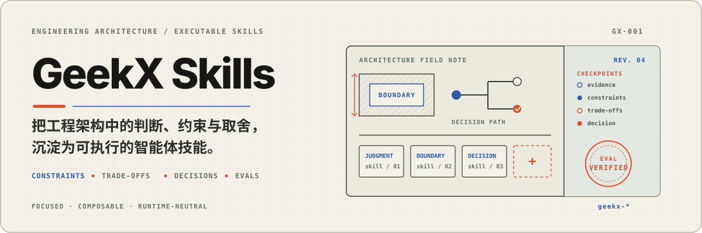

<p align="center">
  
</p>

---

## 这是什么

GeekX Skills 是 [geekjourneyx](https://github.com/geekjourneyx) / 极客杰尼的智能体技能合集。

它不追求把所有想法都变成流程，而是把真实工作里反复出现、容易跑偏、需要稳定判断的环节沉淀成技能。

## 为什么需要它

智能体很擅长补全方案，也很容易跳过关键决策，或把一个小需求扩写成完整系统。

- `geekx-gate`：先砍噪音、算复杂度税、确认非目标，再决定是否进入设计。
- `geekx-grilling`：一次追问一个关键决定，给出推荐项和备选理由，在行动前形成共同理解。

## 核心能力

`geekx-gate` 强制智能体输出一个裁决，而不是输出一套越来越大的计划：

- 保留、砍掉、延期、先验证或缩小范围
- 跳过、`STOP`、`HOLD` 或 `PROBE`
- 真实需求、噪音、非目标、复杂度税和唯一下一步

`geekx-grilling` 强制智能体把提问变成可决策的选项：

- 一次只问一个高影响问题
- 按依赖顺序关闭重大决策分支，不遗漏仍有效的并行决定
- 推荐项排第一，并说明第一性原理和逆向理由
- 每个备选项都说明适用条件、代价和风险
- 有结构化提问工具时必须调用
- 达成共同理解前不行动

## 可用技能

| 技能 | 适合什么时候用 |
|:---|:---|
| `geekx-gate` | 审查需求、工程计划、架构提案、路线图或智能体输出是否过度设计；判断重写、框架、插件系统、工作流引擎等难撤回技术决定现在该不该做。 |
| `geekx-grilling` | 通过连续单题追问压力测试计划、决定或想法；要求每个问题提供推荐项、备选项和理由，并在行动前确认共同理解。 |

## 快速开始

安装全部技能：

```bash
npx skills add geekjourneyx/geekx-skills --all
```

查看可用技能：

```bash
npx skills add geekjourneyx/geekx-skills --list
```

只安装 `geekx-gate`：

```bash
npx skills add geekjourneyx/geekx-skills --skill geekx-gate
```

只安装 `geekx-grilling`：

```bash
npx skills add geekjourneyx/geekx-skills --skill geekx-grilling
```

## 使用示例

```text
使用 geekx-gate 审查这个方案是否过度设计。
```

```text
使用 geekx-gate 找出这个需求的最小必要升级。
```

```text
使用 geekx-gate 判断现在要不要引入插件系统。
```

```text
使用 geekx-gate 判断这次重写是否有足够证据。
```

```text
开庭。使用 geekx-gate 多线程审判这个路线图，判断哪些该砍掉。
```

```text
使用 geekx-grilling 逐项追问这个产品计划，每次只问一个关键问题。
```

```text
Grill me。给出推荐项和备选项，并解释每个选择的代价。
```

## 技能约束

每个技能都遵守这些仓库级约束：

- 目录名必须以 `geekx-` 开头。
- `SKILL.md` 的 `name` 必须与目录名一致。
- 每个技能必须包含 `evals/evals.json`。
- 用户可读内容默认使用中文；机器标识、命令和固定协议值保持原样。
- README 只列用户需要知道的技能；维护规则以 `AGENTS.md` 为准。

## 作者

- 主页：[jieni.ai](https://jieni.ai)
- GitHub：[@geekjourneyx](https://github.com/geekjourneyx)
- X：[@seekjourney](https://x.com/seekjourney)
- 公众号：极客杰尼

## 许可证

[MIT](./LICENSE)
