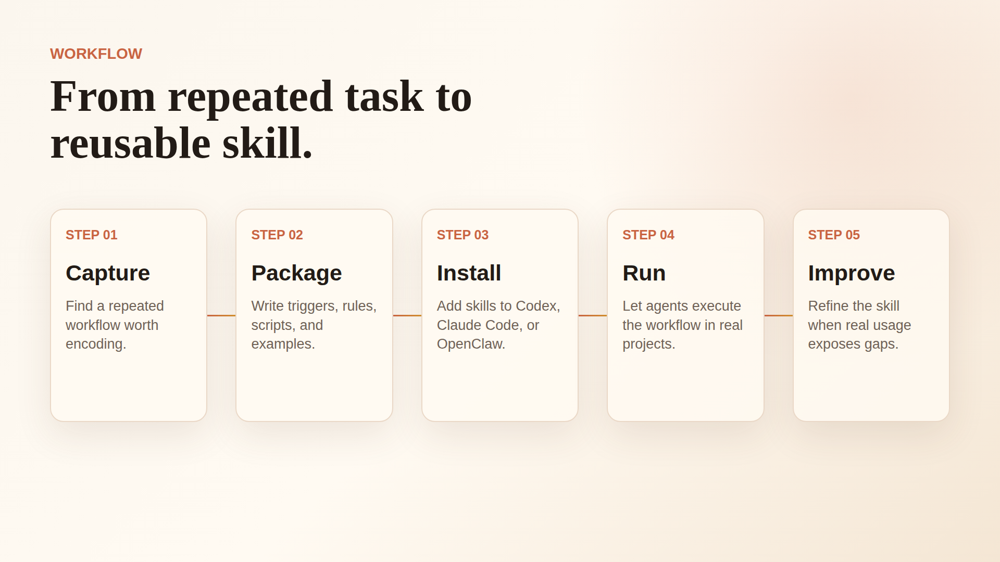

<div align="center">

# GeekX Skills

**Daily AI Agent skills for agent-compatible coding, creator, and automation workflows.**


[](./LICENSE)
[](./README.md)
[](./README.md)

</div>

---

## What This Is

GeekX Skills is a curated collection of AI Agent skills used by [geekjourneyx](https://github.com/geekjourneyx), also known as Geek Jieni, for daily coding, writing, publishing, review, and automation.

Each skill is designed to turn a repeated workflow into a reusable agent-native routine: clear trigger, clear instructions, optional scripts, and enough context for coding agents to execute reliably.

```text
Input:  a repeated workflow you run by hand
Output: a reusable AI Agent skill that compatible agents can run
```

---

## Core Features


---

## Available Skills

| Skill | Use when |
|:---|:---|
| `geekx-necessity-gatekeeper` | Reviewing requirements, plans, architecture proposals, MVP scope, roadmap items, or agent outputs that may be over-designed or missing proof of necessity. |

---

## Workflow



---

## Installation

Install all skills from this repository:

```bash
npx skills add geekjourneyx/geekx-skills --all
```

List available skills before installing:

```bash
npx skills add geekjourneyx/geekx-skills --list
```

Install a specific skill. All skills in this repository use the `geekx-` prefix:

```bash
npx skills add geekjourneyx/geekx-skills --skill geekx-<name>
```

Install for a specific agent:

```bash
npx skills add geekjourneyx/geekx-skills --agent <agent-name> --skill geekx-<name>
```

---

## Quick Start

After installation, ask your agent to use one of the installed skills by name or by describing the workflow you want to run.

```text
Use geekx-necessity-gatekeeper to review this plan for overengineering.
```

```text
Use geekx-necessity-gatekeeper court mode to judge whether this roadmap item should be kept, cut, deferred, validated first, or shrunk.
```

```text
Use geekx-necessity-gatekeeper to find the smallest necessary upgrade.
```

---

## Repository Structure

```text
geekx-skills/
  skills/                 reusable AI Agent skills
    geekx-<name>/
      SKILL.md            trigger rules and execution instructions
      scripts/            optional local helpers
      references/         optional reusable context
  assets/                 README images and project media
  scripts/                repository maintenance scripts
```

Each skill should be self-contained. If a skill needs scripts, templates, or reference material, keep them inside that skill folder so agents can load only the context they need.

---

## Naming Rule

Every skill in this repository must use the `geekx-` prefix.

```text
geekx-readme-generator
geekx-scope-review
geekx-md2wechat
geekx-content-polish
```

This keeps the collection recognizable across installers, marketplaces, search results, and copied skill folders. Do not add generic names like `review`, `writer`, or `scope-review` here; use `geekx-review`, `geekx-writer`, or `geekx-scope-review`.

---

## Author

| | |
|:---|:---|
| Homepage | [jieni.ai](https://jieni.ai) |
| GitHub | [geekjourneyx](https://github.com/geekjourneyx) |
| X / Twitter | [@seekjourney](https://x.com/seekjourney) |
| WeChat | Search for `极客杰尼` |

---

## License

[MIT](./LICENSE) - free to use, modify, and distribute.

---

## GitHub Metadata

Suggested repository description:

```text
AI Agent skills collection by geekjourneyx / Geek Jieni for agent-compatible coding, creator, and automation workflows
```

Suggested topics:

```text
ai-agents
agent-skills
codex
claude-code
openclaw
automation
developer-tools
creator-tools
geekjourneyx
jieni
```
